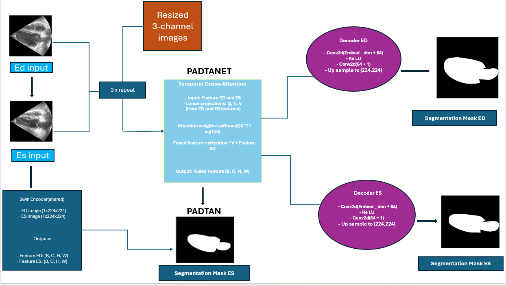

# PADTAN++

> **PADTAN++: A Temporal Attention-Based Multi-Phase Framework for Echocardiographic Segmentation**

##  Overview

PADTAN++ is a novel transformer-based deep learning framework for accurate and temporally consistent left ventricle segmentation in echocardiographic sequences.

Unlike conventional frame-wise segmentation methods, PADTAN++ explicitly models temporal dependencies between End-Diastolic (ED) and End-Systolic (ES) cardiac phases using temporal cross-attention while preserving anatomical consistency through volume-aware learning.

The framework is designed for AI-assisted cardiac analysis and evaluated on the CAMUS echocardiography dataset.

---

## Key Features

- Temporal Cross-Attention between ED and ES phases
- Dual-Path Decoder Architecture
- Multi-Scale Feature Fusion
- Anatomy-Aware Volume Regularization
- Swin Transformer Backbone
- Clinically Consistent Cardiac Segmentation
- End-to-End PyTorch Implementation

---

##  Model Architecture

PADTAN++ consists of:

1. Shared Swin Transformer Encoder
2. Temporal Cross-Attention Module
3. Multi-Scale Feature Fusion
4. Dual Decoder Network
5. Anatomy-Aware Regularization

---

##  Dataset

Experiments are performed on the **CAMUS** echocardiography dataset.

Dataset includes:

- End-Diastolic (ED) Frames
- End-Systolic (ES) Frames
- Left Ventricle Masks

## Results

PADTAN++ focuses on improving:

- Dice Score
- Hausdorff Distance
- Mean Absolute Distance
- Temporal Consistency
- Volumetric Accuracy

---

##  Applications

- Echocardiography Segmentation
- Cardiac Function Analysis
- AI-assisted Diagnosis
- Medical Image Analysis
- Clinical Decision Support

---

## Tech Stack

- Python
- PyTorch
- OpenCV
- NumPy
- Swin Transformer

---

##  Authors

**Sriman Narayana**

Indian Institute of Information Technology Design and Manufacturing Jabalpur

---

##  Future Work

- Multi-view Echocardiography
- 3D Cardiac Segmentation
- Domain Adaptation
- Vision-Language Models
- Foundation Models for Medical Imaging

---

## 📜 License

MIT License
